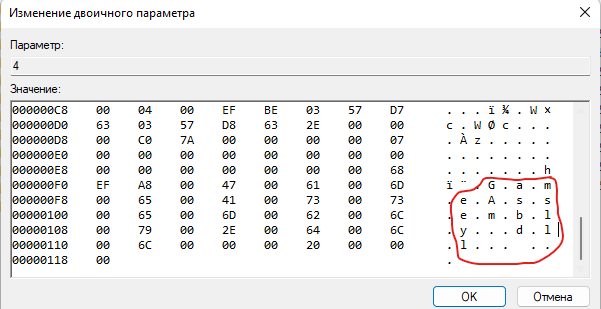
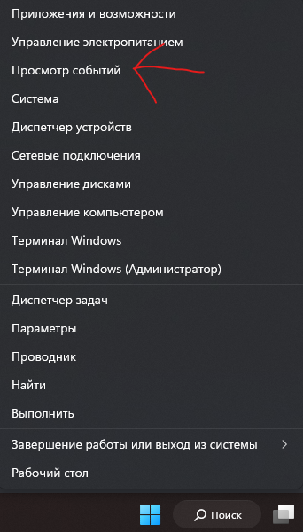
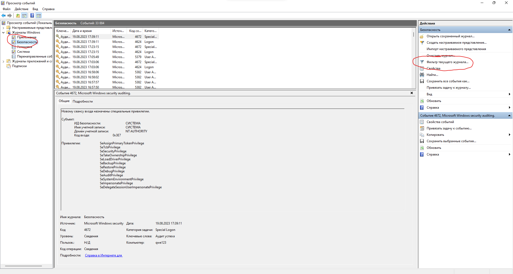

# Общая информация
+ > чекнуть отдачу оружия в игре(инвентарь)
+ > нажать f1>tools
+ > alt+enter, стянуть игру в маленькое окошечко(если она начала багаться и все смещается - бан. Это значит, что у человека была подгружена imgui menu)
+ > Окрываем Discord, нажимем на плюсик  и отправить файл
  > В открывшемся окне ищему строку выбора файла и нажимаем на стрелочку 
  > Ищем подозрительные файлы, если будет совсем чисто, это похоже на чистку

+ > Нажимаем на панели задач на значок интернета -> параметры Сети и Интернет
  > В открывшемся окне нажимаем на Использование данных
  > Ищем Лоадеры читов/макросов
  
+ > Создаем .rar and .txt на панель задач и правой кнопкой мыши
+ > Нажимаем win+r 
    > Пишем / ищем подозрительные файлы
    > Пишем recent(сортировка: по дате). Если пишет отказано в доступе: shell:recent

+ > Нажимаем win+r и пишем prefetch
    > Если папка чистая полностью, следуйте инструкции ниже
      1. Нажмите на клавишу Windows + R, чтобы открыть окно "Выполнить".
      2. Введите "eventvwr.msc" и нажмите Enter, чтобы открыть Журнал событий.
      3. В левой панели выберите "Журналы Windows" и затем "Система".
      4. В правой панели найдите кнопку сохранить все события как и сохраните их в txt
      5. Далее откройте файл в текстовом редакторе который вы сохранили
      6. В поиске введите "Service Control Manager и посмотрите манипуляции с этой службой, если она была отключена, недавно и на пк нету CCleaner или других программ на очистку, вероятно человек почистился чем-то 
      7. Еще посмотрите службу Служба кэша шрифтов Windows, эта служба может быть отключена специально чтобы не показывать остатки читов в process hacker, а именно fontcache 

       ```Служба кэша шрифтов Windows"" был изменен с ""Автоматически"" на ""Вручную"".```

    > Если в папке несколько файлов, возможно человек почистился руками

+ > Получаем список аккаунтов игрока
    > Скачиваем getAccountCheck в репозитории 
      > p.s. Взял у этого человека [батник](https://ru.wikipedia.org/wiki/Ковариантность_и_контравариантность_(математика))
    > Открываем -> действуем по инструкции
    > Получаем аккаунты игрока и пробиваем их
  
+ > Нажимаем win+r и пишем appdata
  > Какая мышка? Logitech - поиск lua, txt файлов. Razer - .xml . Bloody - .amc. Если мышка одна из выше перечисленных брендов: win+r > appdata>Local>(mouse name), чекаем дату изменения папки scripts
  > Заходим в Local\CrashDumps и смотрим подозрительные файлы, могут быть: Читы, макросы, инжекторы
  > Далее возвращаемся в appdata и переходим в Roaming и смотрим каждую папку по названию, тут сохраняются конфиги читов

+ > Открываем временные файлы win+r> %temp%
  
+ > Октрываем папку с игрой и Смотрим наличе подозрительных папок или файлов (Пример: Папка Skyline, Файл imgui.ini)
  > Смотрим папку Screenshots

+ > Проверьте главный лиск  
+ > win+v(если открывается буфер обмена - нажимаем включить и ищем ссылку на pastebin или что-то подозрительное.)
  
+ > win+e > просматриваем быстрый доступ, загрузки, другие диски
  
+ > Нажимаем windows и начинаем писать "удаление", после открываем "Установка и удаление программ" > там ищем программу total commander
  > если программа есть - спрашиваем зачем, открываем ее   и   смотрим по какому пути он открылся последний раз(если при открытии приложения путь до ПО мышки - бан нахуй)

+ > открываем основной браузер, начинаем поиск по ключевым словам в истории > lua, rust, cheat, macro, чит, макро, soft, free, phoenix, vilonity.
  > просматриваем загрузки браузера
  > открываем ВК, слева снизу кнопка "файлы"> просматриваем странные файлы. > Поиск по ключевым словам ВК и личные сообщения
  
+ > просмотр телеграмм при наличии обязательно!!
  
+ > скачиваем шелбаг>если есть удаленные пути к ПО мышки - бан
  
+ > скачиваем everythink > поиск по ключевым словам
    ```lua, xml, amc, dll, cfg, Exloader и др...```
  > > Проверьте наличие у человека Exloader
  
+ > скачиваем LastActivityView > смотрим промежуток примерно 15-25 приложений от запуска раста. Советую вводить еще в поиск Exloader и .dll . Обязательно посмотрите был ли запуске CCleaner перед вызовом на проверку
  
+ > скачиваем userassist_view > смотрим все файлы, ищем что-то подозрительное или недавно измененное

+ > скачиваем jump_lists_view > смотрим все файлы, ищем что-то подозрительное или недавно измененное
  
+ > win+r > regedit, вводим по очереди и чекаем
    >> HKEY_CURRENT_USER\SOFTWARE\Classes\Local Settings\Software\Microsoft\Windows\Shell\MuiCache
    >> HKEY_CURRENT_USER\SOFTWARE\Microsoft\Windows NT\CurrentVersion\AppCompatFlags\Compatibility Assistant\Store
    >> HKEY_CURRENT_USER\SOFTWARE\Microsoft\Windows\CurrentVersion\Explorer\FeatureUsage\AppSwitched
    >> HKEY_CURRENT_USER\SOFTWARE\Microsoft\Windows\CurrentVersion\Explorer\FeatureUsage\ShowJumpView
    >> HKEY_LOCAL_MACHINE\SYSTEM\CurrentControlSet\Services\bam

+ > снова открываем браузер, открываем oplata.info > прогоняем все почты, что есть в браузере
+ > открываем funpay > пробуем авторизоваться, так же делаем на форумах phoenix, evil.

# Как проверять путь regedit (OpenSavePidlMRU)

1. Переходим по пути в regedit

``` Компьютер\HKEY\_CURRENT\_USER\Software\Microsoft\Windows\CurrentVersion\Explorer\ComDlg32\OpenSavePidlMRU ```

2. открываем регедит, вводим путь > видим папки с расширениями файлов (скрин 1)
3. открываем папки, нас интересует только dll, exe, txt, rar, bat
4. открываем каждый файл в папке по очереди и листаем вниз, там будет название файла (скрин 2 - Gameassembly.dll - BAN)
5. и так с каждым файлов в каждой папке



# Проверить игрока на чистку файлов: 
1) Правой кнопкой мыши по кнопке Windows -> Просмотр событий(если такой кнопки нет, то писать в поиске) < 
2) нажимаем на стрелочку "Журналы windows"
3) Вкладка "Безопасность"
4) справа выбираем "Фильтр теукщего журнала" и вводим код "1102" < 
5) В вкладке система всё так же, но код "104"
6) В вкладке приложения все так же, но код 4616

> Если игрок чистился, то по коду в одном из методов найдет строку eveth, смотрите на ее дату, если дата в день проверки - бан
# process hacker и чек DLL: 
1. Скачиваем и распаковывем папку x64 на рабочий стол
2. Запускаем от имени админа ProcessHacker.exe
3. Ищем RustClient.exe и нажимаем ПКМ
4. Открываем Propirties и переходим во вкладку Modules
5. Если в самом низу есть похожие файлы - БАН 
6. Смотрим расположение каждой DLL, не нравится какая-то идем чекать расположение
7. Возвращаемся в ProcessHacke и нажимаем ПКМ по RustClient.exe
8. Выбираем Miscellaneous -> Inject DLL
9. В открывшемся окне ищему строку выбора файла и нажимаем на галочку 
10. Если есть DLLки чекаем каждую


# Полезные ссылки на чит ресурсы 
+ https://botmek.ru/
+ https://phoenix-hack.org/
+ https://evilcheats.io/
+ https://ring-1.io/
+ https://sexru.st/
+ https://hyperaim.gg/store/category/2-hyperaimgg-rust/
+ https://www.spermaware.ru/
+ https://collapse.fun/
+ https://deltacheats.ru/rust

